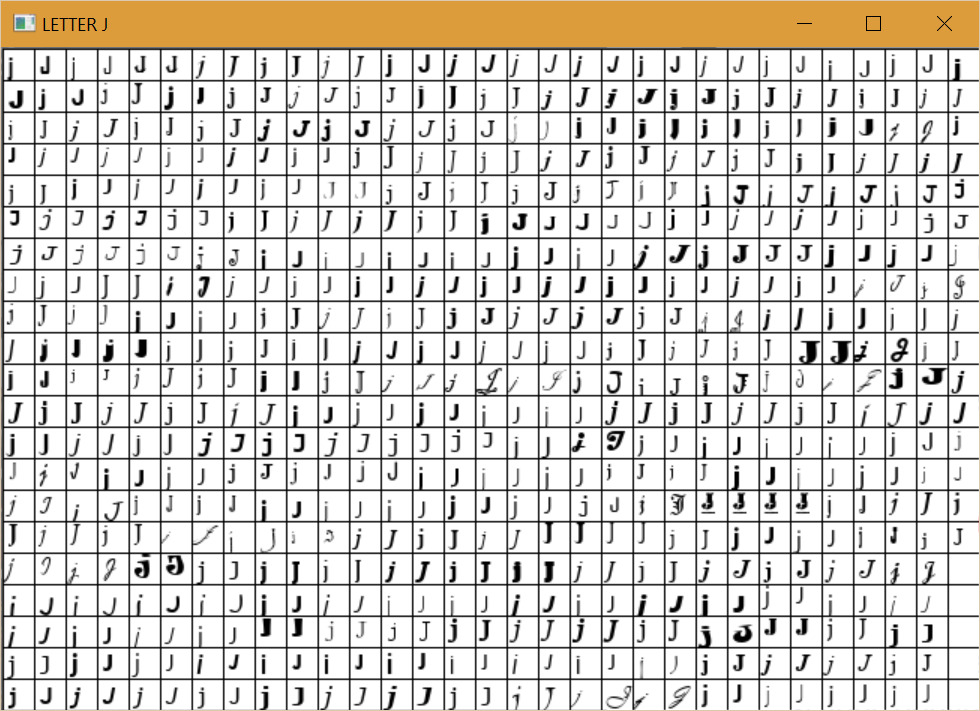

# Letter Recognition

Deep Learning on Letters with TensorFlow : Convolutional Neural Network

| |
|:------------------------:|
|[@jfourmond](https://github.com/jfourmond) |

---

## Goal

The goal of the model is simple : read and synthesize the letter on the image which has been given to the network.

Further application could be text reading...

## Libraries

- [OpenCV](https://opencv-python-tutroals.readthedocs.io/en/latest/)
- [Pillow](https://pillow.readthedocs.io/en/3.1.x/index.html)

## Data

Our Convolutional Neural Network use local fonts to be trained and be evaluated. That's why a few preliminary scripts should be run.

### Font Verification - [1-font-verification.py](1-font-verification.py)

> `python 1-font-verification.py`

The first script allow the user to evaluate on which font the model will be allowed to be trained and evaluated.

The user will be prompt to check and choose to exclude (or not) each font readable with the [Pillow](https://pillow.readthedocs.io/en/3.1.x/index.html) Library. For example, webdings fonts are readable by this library but not humanly readable.

The excluded fonts will be added in a json file (`data/excluded-fonts.json`) which will be used in the next script.

### Data Creation - [2-data-creation.py](2-data-creation.py)

> `python 2-data-creation.py`

The second script, with local fonts and the json file `data/excluded-fonts.json`, will stored each lowercase and uppercase letters of each fonts not excluded in the directory `data/letter-recognition/`.

### Dataset Building - [3-dataset-building.py](3-dataset-building.py)

> `python 3-dataset-building.py`

The third is the dataset building script. Based on the directory `data/letter-recognition/`, the script will create a directory of training images (`data/train`), a directory of test images (`data/test`) and a final directory of images for prediction (`data/predict`)

### Bonus - [data-img-visualizer.py](data-img-visualizer.py)

> `python data_img_visualizer.py LETTER`

The Img Visualizer is a bonus script used in order to visualize every stored images of the specify letter.

## Convolutional Neural Network

Two very close models can be build, each one with a different script. The only difference is the prediction result : one give only the highest rank label, while the other give the highest rank label and his probability.

### Build, train and evaluate the model

> `python letter-image-recognition.py -n 600 -b 50 -md /tmp/letter -p True`

> `python letter-image-recognition-prob.py -n 600 -b 50 -md /tmp/letter-prob -p True`

### Use case

> `python image_reading.py /tmp/letter img/alphabet.png`

> `python image_reading_prob.py /tmp/letter-prob img/alphabet.png`

> `python image_reading_static.py /tmp/letter-prob img/hello_world_uppercase.png`