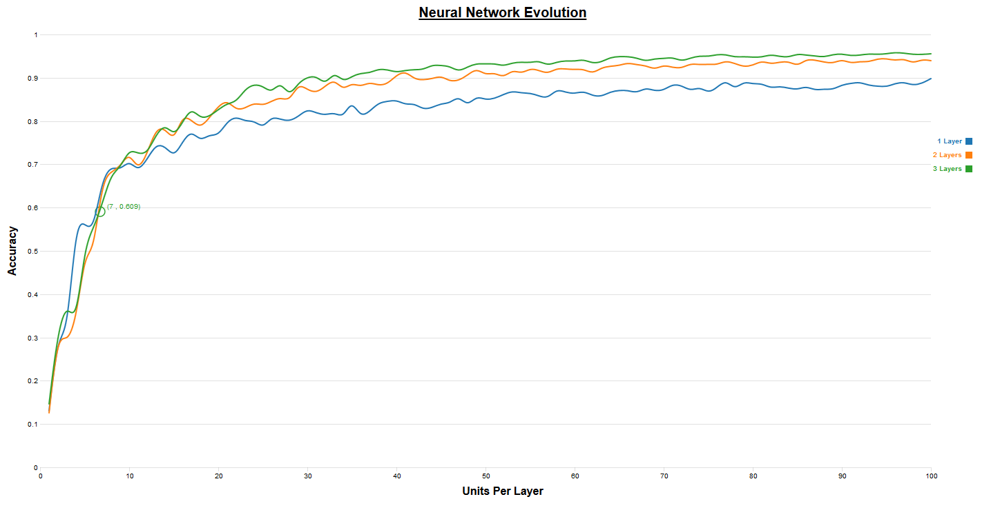
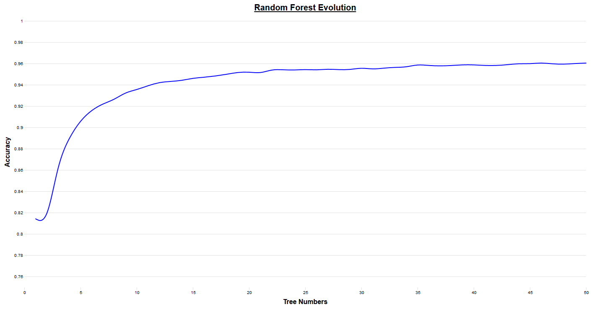

# Letter Recognition

Python Deep Learning on the "[Letter Image Recognition Data](https://archive.ics.uci.edu/ml/machine-learning-databases/letter-recognition/)" with TensorFlow

---

## Data

The "[Letter Image Recognition Data](https://archive.ics.uci.edu/ml/machine-learning-databases/letter-recognition/)" comes from the [the UC Irvine Machine Learning Repository](http://archive.ics.uci.edu/ml/).

As specifiy in the [data description](https://archive.ics.uci.edu/ml/machine-learning-databases/letter-recognition/letter-recognition.names), the dataset is composed of 17 attributes (one label and 16 features).

Its main goal is :
> The objective is to identify each of a large number of black-and-white rectangular pixel displays as one of the 26 capital letters in the English alphabet.  The character images were based on 20 different fonts and each letter within these 20 fonts was randomly distorted to produce a file of 20,000 unique stimuli.  Each stimulus was converted into 16 primitive numerical attributes (statistical moments and edge counts) which were then scaled to fit into a range of integer values from 0 through 15.  We typically train on the first 16000 items and then use the resulting model to predict the letter category for the remaining 4000.

This isn't image recognition.

This project was made to learn TensorFlow, and use one Deep Neural Network for classification, similarly as the Housing Data from the [TensorFlow library Get Started Page](https://www.tensorflow.org/get_started/input_fn).
The results obtained from the Deep Neural Network are compared to the results of the Random Forest.

The original dataset has been divided in 3 parts : the training dataset, the test dataset, and the evaluation dataset.

## Models

The model is trained on the ***16000*** examples of the [letter-recognition-training.csv](https://github.com/jfourmond/TensorFlowLetterRecognition/blob/master/letter-recognition-training.csv) file, evaluated on the ***3900*** examples of the [letter-recognition-test.csv](https://github.com/jfourmond/TensorFlowLetterRecognition/blob/master/letter-recognition-test.csv) file, and finally predictions are made on the 100 ***examples*** of the [letter-recognition-eval.csv](https://github.com/jfourmond/TensorFlowLetterRecognition/blob/master/letter-recognition-eval.csv) file as a demonstration of the model.

### Deep Learning Model

> ` letter-recognition-dnn.py [-h] [--model_dir MODEL_DIR] [--n_steps N_STEPS] [--results_file RESULTS_FILE] [--hidden_units [HIDDEN_UNITS [HIDDEN_UNITS ...]]]`

> `$> python letter-recognition-dnn.py --hidden_units 8 8 8`

The Deep Neural Network model has the following optional configurable caracteristics :
- hidden_units : an array depicted the number of neurons per layer (for example `[10, 20]` means two hidden layers with 10 neurons on the first one, and 20 on the second)
- model_dir : the directory where the model will be stored

It is possible to edit the activation functions or the optimizer.

```python
classifier = tf.estimator.DNNClassifier(
      		hidden_units=HIDDEN_UNITS,
	      	feature_columns=feature_cols,
		 	    model_dir=MODEL_DIR,
			     n_classes=26,
			     label_vocabulary=LABEL_VOCABULARY)
```

In order to configure those settings, the script present several arguments :
- model_dir : the directory where the model will be stored (default : `/tmp/letter-recognition-dnn`)
- n_steps : the number of steps for which to train the model (default : `10000`)
- results_file : File where the results of the model could be stored (default : `None`)
- hidden_units : the array for the number of hidden units per layer (default : `[16, 16, 16]`)

### Random Forest Model

> `$> letter-recognition-rf.py [-h] [--max_depth MAX_DEPTH] [--n_trees N_TREES] [--random_state RANDOM_STATE] [--results_file RESULTS_FILE]`

> `$> python letter-recognition-rf.py --n_trees=10 --random_state=0`

The Random Forest model has the following optional configurable caracteristics :
- n_estimators : the number of trees in the forest
- max_depth : the maximum depth of the tree
- random_state : the seed used by the random number generator

```python
clf = RandomForestClassifier(
        n_estimators=N_TREES,
        max_depth=MAX_DEPTH,
        random_state=RANDOM_STATE)
```

In order to configure those settings, the script present several arguments :
- max_depth : the maximum depth of the tree (default : `None`)
- n_trees : the number of trees in the forest (default : `10`)
- random_state : the seed used by the random number generator (default : `None`)
- results_file : File where the results of the model could be stored (default : `None`)

### Visualisation

TensorBoard can be used in order to visualize the graph, or the learning process, of the neural network, by specifying the model directory...

``` $> tensorboard --logdir=/tmp/letter-recognition```

### Accuracy

#### Machine Configuration

- OS : Windows 7 Professionnel 64 bits
- CPU : Intel(R) Core(TM)2 Duo CPU P8600 @ 2.40GHz 2.39GHz
- RAM : 4 Go

#### Deep Neural Network

The following graph show the accuracy evolution of the Deep Neural Network Classifier model depending on the number of units per layers. Only five layers has been tested, each with the same amount of units.

The results are obtained by the campaign batch script *[campaign_dnn.bat](campaign_dnn_1_layers.bat)* which should be run with an unique argument corresponding to the number of layers of the neural network. The script execute the deep neural network python script several times with 10000 steps from 1 to 100 units per layer and create a CSV file *[letter-recognition-dnn-[layer].csv]*, in our case :
- [letter-recognition-dnn-1-layers.csv](letter-recognition-dnn-1-layers.csv)
- [letter-recognition-dnn-2-layers.csv](letter-recognition-dnn-2-layers.csv)
- [letter-recognition-dnn-3-layers.csv](letter-recognition-dnn-3-layers.csv)
- [letter-recognition-dnn-4-layers.csv](letter-recognition-dnn-4-layers.csv)
- [letter-recognition-dnn-5-layers.csv](letter-recognition-dnn-5-layers.csv)

The chart can be visualised [here](https://htmlpreview.github.io/?https://github.com/jfourmond/TensorFlowLetterRecognition/blob/master/visualisation/dnn-vizu.html).



#### Random Forest

The following graph show the accuracy evolution of the Random Forest model depending on the number of trees.
The results are obtained by the campaign batch script *[campaign_rf.bat](campaign_rf.bat)*, which create the CSV file *[letter-recognition-rf.csv](letter-recognition-rf.csv)*.

The chart can be visualised [here](https://htmlpreview.github.io/?https://github.com/jfourmond/TensorFlowLetterRecognition/blob/master/visualisation/rf-vizu.html).

The results can be fully visualised [here](letter-recognition-rf.csv).

